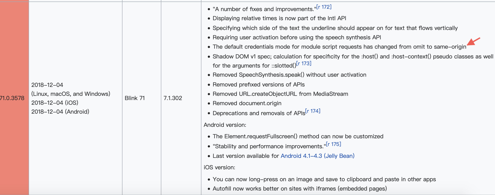

fetch 发送请求默认是不发送 cookie 的，不管是同域还是跨域；那么问题就来了，对于那些需要权限验证的请求就可能无法正常获取数据，这时可以配置其 `credentials` 项，其有 3 个值：

-   `omit`: 默认值，忽略 cookie 的发送
-   `same-origin`: 表示 cookie 只能同域发送，不能跨域发送
-   `include`: cookie 既可以同域发送，也可以跨域发送

fetch 默认对服务端通过 Set-Cookie 头设置的 cookie 也会忽略，若想选择接受来自服务端的 cookie 信息，也必须要配置 credentials 选项。

更新:

在新版的 chrome 中已经将默认值从 omit 修改为 same-origin .

附一张 chrome 的 changelog:

