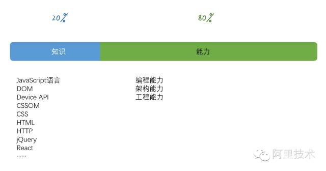

--- 
title: 《不止代码》读后感
date: 2018-6-3
tags:
 - 读后感
categories: 
 - 一些感想
---

  小伙伴在群里分享了阿里《不止代码》，一个由阿里大佬们分享的技术精选集，忙里偷闲把关于前端的部分**浏览**了一遍，有如下感受：

  首先，从一个大的视角来看，前端是聚合的，也是离散的。所谓聚合，即技术上的归一，会逐渐往一方面去靠，例如虚拟dom（react），引擎（webkit/v8）。所谓离散，即技术种类，发展方向的分离。前端发展至今，几乎能做所以的事:图形、端技术、泛Node、开发者服务...而这些分路今后也会越来越清晰。无论是聚散还是离合，其核心依然不变，包括计算机科学本质、软件工程思想与实践和程序员职业素养

  其次，从个人修养来说，前端新技术层出不穷，技术风向不停更变，在这个“混乱”的前端开发时代，作为一个前端er，应该抓住其不变的部分。
  
  引用一张文中的图如下

  

  其不变部分为80%的能力，在我看来，能力分为已有能力和学习能力，已有能力能让我们将现有知识更好的应用，而学习能力评价一个人潜力的指标。

  事实上，那20%的知识中，也有一部分是不变的，通常被叫做标准或者协议，很少出现标准被推翻的情况，新的技术也大都是基于现有的标准，所以说，想要快速上手新技术，基本功的扎实是很有必要的。这也是为什么大公司在面试的时候侧重基础能力的考察！

  以上是我初读《不止代码》的一些想法，最后用书中一句话激励自己不断学习:

  > 虽然到处都是“一万小时训练”的言论，现在各大公司的招聘门槛，在我看来应该都卡在几百小时训练的程度。所以我想说，一万小时太久，只争朝夕。做更好的自己。

